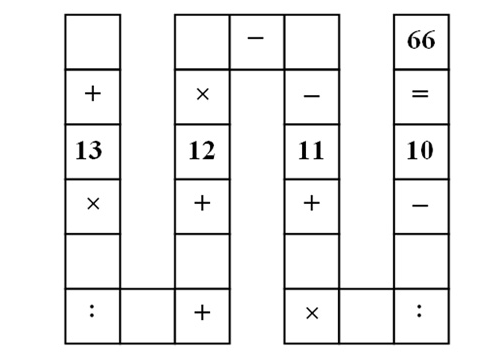

# Vietnamese Puzzle Brute-Force Solver (Rust)

This project brute-forces a 9-variable digit puzzle associated with the
"Vietnamese 8-year-old math puzzle" that went viral around May 2015.

Original work on this solver started on **November 4, 2025**.



## Puzzle Setup

Assign digits `1..9` to `A..I`, using each digit exactly once.

This code currently solves the equation in this form:

`A + (13*B)/C + D + 12*E - F - 11 + (G*H) + I - 10 = 66`

The implementation avoids fractions by rearranging:

`13*B = (66 - base)*C`

where:

`base = A + D + 12*E - F - 11 + G*H + I - 10`

## Note About the Viral "Classic" Version

The most-circulated meme/photo version is typically written with division in
the final term:

`A + (13*B)/C + D + 12*E - F - 11 + (G*H)/I - 10 = 66`

So this repository currently matches a close variant (`G*H + I`) rather than
the strict classic (`(G*H)/I`).

## Run

```bash
cargo run
```

## References Commonly Cited for the Viral Puzzle

- MindYourDecisions coverage of the Vietnam puzzle
- The Guardian coverage of the same viral puzzle
- Various math blog reposts that show the same `A..I` layout and equation
